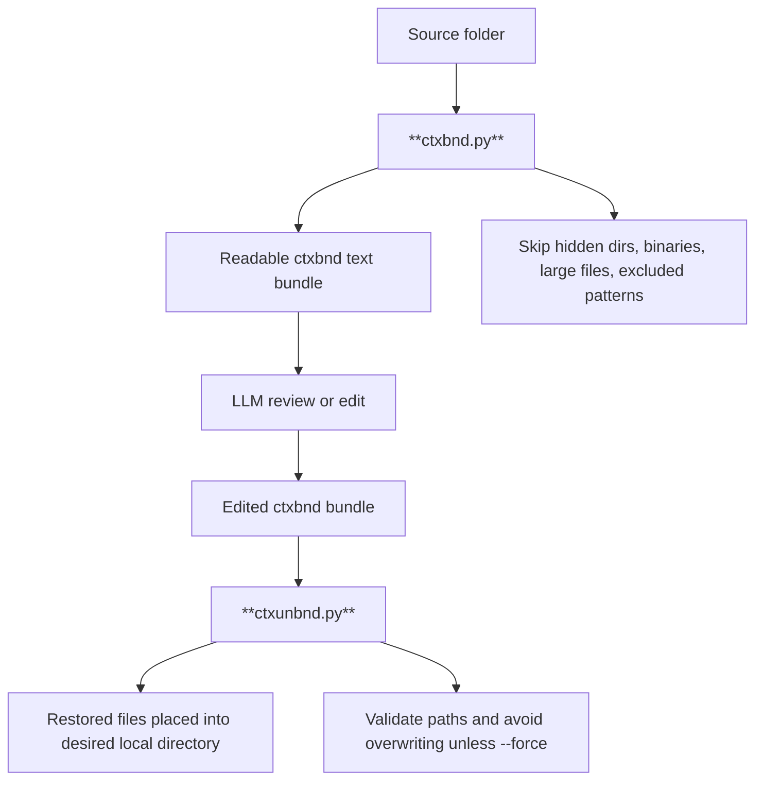

# ctxbnd_ctxunbnd
Lightweight utility to pack multiple files among multiple directories into a **single** plaintext markup file. This facilitates multi-file multi-directory operations for any LLM interface, in particular those with a simple prompt I/O.

## 📦 Overview

`ctxbnd` packs a directory tree into a single, LLM-readable plaintext bundle using namespaced XML-style tags. `ctxunbnd` safely reconstructs files and directories from that bundle.

The intended workflow is simple:

1. Use `ctxbnd` to bundle a source folder into one readable text file.
2. Paste that bundle into an LLM prompt, or feed it into a larger local/RAG workflow.
3. Ask the LLM to review, modify, or return files while preserving the `ctxbnd` markup structure.
4. Save the LLM output locally.
5. Use `ctxunbnd` to un-bundle the result into a real directory tree.

`ctxbnd` is optimized for readable LLM editing, not compression, encryption, or general-purpose archival. 

It favors minimal dependencies, deterministic output, low token overhead, and conservative filesystem safety checks.

## 🚀 Quick Start
```bash
# Make executable on first run (Unix/macOS/Linux)
chmod +x ctxbnd.py ctxunbnd.py

# Pack current directory (default: 20 files max)
./ctxbnd.py . -o context_files_collection.txt

# Unpack to a new directory
./ctxunbnd.py context_files_collection.txt -o ./restored_project
```

## 🏗️ Architecture & Design Principles

| Principle                | Implementation                                                                                                                       |
| ------------------------ | ------------------------------------------------------------------------------------------------------------------------------------ |
| **LLM-first format**     | File contents are written as raw text for readability. The reserved closing delimiter is guarded against to prevent parser breakage. |
| **Namespaced tags**      | `<ctxbnd__file path="...">` avoids collisions with common code patterns such as `<file>`, `</file>`, JSX, and HTML templates.        |
| **Deterministic output** | Files are sorted alphabetically, case-insensitively, for reproducible bundles and cleaner diffs.                                     |
| **Portable text output** | Bundle structure uses stable LF separators and UTF-8 text handling.                                                                  |
| **Zero dependencies**    | Pure Python 3.10+ standard library. No external packages required.                                                                   |
| **Local-first workflow** | No service, server, account, or network access required.                                                                             |

### 🔑 Why ctxbnd_ctxunbnd Fills a Real Gap
| Aspect | Typical Alternatives | ctxbnd_ctxunbnd |
|--------|---------------------|-----------|
| **Dependencies** | `pip install` heavy frameworks, AST parsers, or IDE plugins | Zero dependencies. Runs on any Python 3.10+ env instantly |
| **Output Format** | Base64 blobs, JSON dumps, or opaque serialization | Human/LLM-readable XML-like structure with raw syntax preserved |
| **Safety Controls** | Often missing or bolted-on later | Built-in: path traversal guards, max limits, delimiter collision handling, cross-platform line endings |
| **Token Efficiency** | Escaping, metadata bloat, or structural overhead | Namespaced tags + zero content escaping = minimal token tax |
| **Workflow Fit** | Tied to specific editors/agents or require config files | Drop-in CLI. Works in CI, local dev, or LLM prompt pipelines out of the box |

### 🌍 Where ctxbnd_ctxunbnd Shines
- **LLM Context Windows**: Models parse raw code significantly better than escaped or serialized formats. ctxbnd_ctxunbnd keeps type hints, JSX, shell scripts, and markdown fully intact.
- **Reproducibility & Debugging**: Deterministic sorting + transparent tags make diffs clean and failures traceable. No black-box packing.
- **Portability**: Runs on Windows/macOS/Linux without venv setup or compilation. Perfect for quick scripting, Docker containers, or restricted environments.
- **Extensibility**: Simple enough to fork/modify, robust enough to trust with production codebases.

## 📖 Command Reference

### `ctxbnd.py` (Packer)
| Argument | Description | Default |
|----------|-------------|---------|
| `directory` | Target directory to pack | `.` (current dir) |
| `-o, --output` | Output bundle file path | `context_files_collection.txt` |
| `--max-size BYTES` | Skip files larger than this size | None (no limit) |
| `--exclude PATTERN` | Glob pattern to skip files/dirs. Repeatable. | None |
| `--max-files N` | Maximum number of files to pack. Use `-1` for unlimited. | `20` |

### `ctxunbnd.py` (Unpacker)
| Argument | Description | Default |
|----------|-------------|---------|
| `bundle` | Path to the `.txt` bundle file | *(required)* |
| `-o, --output` | Target directory for unpacked files | `.` (current dir) |
| `--force` | Overwrite existing files without warning | Disabled |
| `--max-files N` | Maximum number of files to unpack. Use `-1` for unlimited. | `20` |

> 💡 All status messages, warnings, and errors are written to `stderr`, leaving `stdout` clean for piping or scripting.

## 🛡️ Safety & Exception Handling

The tools prioritize safe, predictable behavior over silent failures.

| Scenario                         | Behavior                                                                                                    |
| -------------------------------- | ----------------------------------------------------------------------------------------------------------- |
| **Binary / non-text files**      | Auto-detected via null-byte sampling (`\x00`) and skipped with a warning.                                   |
| **Reserved delimiter collision** | Files containing the reserved ctxbnd closing delimiter are skipped to prevent parser corruption.            |
| **Path traversal protection**    | `ctxunbnd` rejects absolute paths, `..`, and paths that resolve outside the target directory.               |
| **Symlinks**                     | `ctxbnd` skips symlinks by default.                                                                         |
| **Overwrite protection**         | `ctxunbnd` does not overwrite existing files unless `--force` is passed.                                    |
| **Resource limits**              | `--max-files` and `--max-size` help prevent accidental context-window or disk flooding.                     |
| **Permission / OS errors**       | Errors are logged to `stderr` without halting the entire operation.                                         |
| **Encoding issues**              | Files are read as UTF-8 with `errors="replace"` so the packer can continue while marking undecodable bytes. |

## 📄 Bundle Format Specification
```xml
<ctxbnd version="0.1">
<ctxbnd__file path="src/main.py">
#!/usr/bin/env python3
print("Hello, LLM!")
</ctxbnd__file>

<ctxbnd__file path="README.md">
# Project Documentation
...
</ctxbnd__file>
</ctxbnd>
```
- Root wrapper: `<ctxbnd version="0.1">\n` ... `</ctxbnd>\n`
- File blocks: `<ctxbnd__file path="relative/path.ext">\n{raw_content}</ctxbnd__file>\n\n`
- Paths are HTML-escaped (`quote=True`) to handle special characters safely
- Content is written verbatim (no escaping) for maximum LLM/human readability

## 📄 Operational Flow

    
## 🤖 LLM Optimization Notes
- **Raw Syntax Preservation**: No `&lt;`/`&gt;` obfuscation. Python type hints, JSX, HTML, and shell scripts remain fully readable.
- **Minimal Metadata**: Only versioning is included in the header. No timestamps or absolute paths that could confuse model generation.
- **Token Efficiency**: Namespaced tags add ~15 chars/file vs standard XML, but eliminate escaping overhead and parsing ambiguity.
- **Context Caching Friendly**: Deterministic ordering ensures identical bundles produce identical token sequences across runs.

## ⚙️ Requirements
- Python 3.10+ (uses modern union type syntax `Path | None`)
- POSIX or Windows environment (cross-platform line ending handling built-in)

## 🤝 Contributing

Pull requests are welcome. Please keep the project small, readable, and dependency-free. Please ensure to:

* Preserve the zero-dependency, CLI-first design
* Keep the bundle format easy for humans and LLMs to read
* Maintain conservative filesystem safety defaults
* Document new behavior in the README
* Include or update tests for pack/unpack behavior


## 📄 License

This project is licensed under the MIT License. See [LICENSE](LICENSE) for details.


---
*Designed for developers, optimized for models.* 🐍✨